# WikiTruth Platform

A **collaborative web tool** that lets you instantly compare the same Wikipedia article across multiple language editions and GPT models, highlight discrepancies, and export well-structured reports.

---

## ✨ Key Features

| Category                  | Highlights                                                                                       |
| ------------------------- | ------------------------------------------------------------------------------------------------ |
| **Multi-language diff**   | Side-by-side view of the source article and its translations with AI explanations of divergences |
| **AI-powered comparison** | Uses both OpenAI Chat and OpenRouter models for robust fact-checking and style analysis          |
| **One-click export**      | Generate DOCX or shareable links suitable for journalists, students, and researchers             |
| **Privacy-first**         | No user tracking; all sessions stored in ephemeral Keyv storage                                  |
| **Open architecture**     | Express + Node backend with clear API boundaries and pluggable services                          |

---

## 📐 System Architecture

Below is a color-coded Mermaid diagram.
**Legend**

* **White nodes** (💻) — client-side SPA pages
* **Blue nodes** (🚀) — backend API routes
* **Green nodes** (🗄️) — storage
* **Purple nodes** (🤖) — internal services
* **Yellow nodes** (🌐) — external APIs

```mermaid
%% ===== WikiTruth Platform – Styled Workflow (with Color-Coded Arrows) =====
flowchart LR
  %% ---------- Global Styles ----------
  classDef client     fill:#ffffff,stroke:#2563eb,stroke-width:2px;
  classDef navEdge    stroke-dasharray:4 2;
  classDef server     fill:#e0f2fe,stroke:#0284c7,stroke-width:2px;
  classDef db         fill:#dcfce7,stroke:#16a34a,stroke-width:2px;
  classDef ext        fill:#fff7ed,stroke:#f97316,stroke-width:2px;
  classDef internal   fill:#dbeafe,stroke:#2563eb,stroke-width:1px,stroke-dasharray:3 3;

  %% =================== Client-Side SPA ===================
  subgraph Clientside["💻 Client-Side Single-Page App"]
    direction TB
    Main["🏠 MainPage<br>/"]:::client
    Search["🔍 Search<br>/search"]:::client
    LangSel["🌐 Language&nbsp;Selection"]:::client
    ComparePg["📝 Compare<br>/compare"]:::client
    Loading["⏳ Loading"]:::client
    Results["📑 Results"]:::client
    Tools["🛠️ Tools"]:::client
    Recent["🕙 Recent"]:::client
    Help["❓ Help"]:::client
    About["ℹ️ About"]:::client
    How["⚙️ How&nbsp;It&nbsp;Works"]:::client
    Privacy["🔒 Privacy"]:::client
    Terms["📃 Terms"]:::client
    Contact["✉️ Contact"]:::client
    Report["🚩 Report"]:::client
    Thanks["✅ Thank&nbsp;You"]:::client
    NotFound["404"]:::client
  end

  %% ----- Client navigation flow -----
  Main -->|Search| Search
  Search -->|Choose article| LangSel
  LangSel -->|Compare| Loading
  Loading -->|Ready| Results
  Main -.->|Tools| Tools
  Main -.->|Help| Help
  Main -.->|About| About
  Main -.->|How| How
  Main -.->|Privacy| Privacy
  Main -.->|Terms| Terms
  Main -.->|Contact| Contact
  Main -.->|Recent| Recent
  Main -.->|Compare manual| ComparePg
  ComparePg --> Loading
  Results -.->|Report| Report
  Results -.->|Export| Thanks
  NotFound --> Main

  %% =================== Back-End API ===================
  subgraph Backend["🚀 Node / Express API"]
    direction TB
    routeSearch["GET /wikipedia/search"]:::server
    routeLangs["GET /wikipedia/languages"]:::server
    routeArticle["GET /wikipedia/article"]:::server
    routeSessions["POST /sessions"]:::server
    routeCompare["POST /compare"]:::server
    routeGetComp["GET /compare/:id"]:::server
    routeChat["POST /chat-comparison"]:::server
    routeExport["POST /export/docx"]:::server
    routeShare["GET /compare/:id/share"]:::server
    routePayments["POST /payments/create-session"]:::server
    store[(🗄️ Keyv Store)]:::db
    wikiSvc[[🤖 wikipediaService]]:::internal
    orSvc[[🤖 openRouterService]]:::internal
    aiSvc[[🤖 openaiService]]:::internal
    exportSvc[[🤖 exportService]]:::internal
  end

  %% ----- Client → Server API calls -----
  Search --> routeSearch
  LangSel --> routeLangs
  LangSel --> routeArticle
  LangSel --> routeSessions
  ComparePg --> routeCompare
  Loading --> routeGetComp
  Results --> routeChat
  Results --> routeExport
  Results --> routeShare
  Tools --> routeCompare
  Tools --> routePayments

  %% ----- Internal wiring -----
  routeSearch --> wikiSvc
  routeLangs  --> wikiSvc
  routeArticle --> wikiSvc

  routeCompare --> orSvc
  routeCompare --> aiSvc
  routeCompare --> store

  routeChat --> orSvc
  routeChat --> aiSvc

  routeExport --> exportSvc
  routeShare --> store
  routeGetComp --> store

  %% =================== External Services ===================
  subgraph External["🌐 External APIs"]
    direction TB
    Wiki[(Wikipedia REST)]:::ext
    OpenAI[(OpenAI Chat)]:::ext
    OpenRouter[(OpenRouter)]:::ext
  end

  wikiSvc -.-> Wiki
  orSvc -.-> OpenRouter
  aiSvc -.-> OpenAI

  %% ---------- Class assignments ----------
  class Main,Search,LangSel,ComparePg,Loading,Results,Tools,Recent,Help,About,How,Privacy,Terms,Contact,Report,Thanks,NotFound client
  class routeSearch,routeLangs,routeArticle,routeSessions,routeCompare,routeGetComp,routeChat,routeExport,routeShare,routePayments server
  class store db
  class wikiSvc,orSvc,aiSvc,exportSvc internal
  class Wiki,OpenAI,OpenRouter ext

  %% ---------- LinkStyles ----------
  %% Navigation edges (dashed gray)
  linkStyle 4,5,6,7,8,9,10,11,12,14,15 stroke:#94a3b8,stroke-width:1.5px,stroke-dasharray:4 3;

  %% Client→Server API calls (solid cyan)
  linkStyle 17,18,19,20,21,22,23,24,25,26,27 stroke:#0ea5e9,stroke-width:2px;

  %% Internal Backend wiring (solid indigo)
  linkStyle 28,29,30,31,32,33,34,35,36,37,38 stroke:#6366f1,stroke-width:1.5px;

  %% External Service calls (dashed orange)
  linkStyle 39,40,41 stroke:#fb923c,stroke-width:2px,stroke-dasharray:4 2;
```



---

## 🚀 Getting Started

1. **Clone** the repository
2. `pnpm i`  — install dependencies
3. `pnpm dev`  — start vite dev server and backend concurrently
4. Open [http://localhost:5173](http://localhost:5173) in your browser

> ℹ️  Add an `OPENAI_API_KEY` and `OPENROUTER_API_KEY` to `.env.local` for full functionality.

---

## 🗂️ Project Structure

```
apps/
  web/          # React/Vite frontend
  api/          # Express backend
packages/
  wikipedia/    # Wikipedia fetch wrapper
  compare/      # GPT comparison logic
  ui/           # Tailwind + shadcn/ui components
```

---

## 🤝 Contributing

PRs welcome! Please open an issue first to discuss your idea.

---

## 📄 License

MIT © 2025 WikiTruth team
